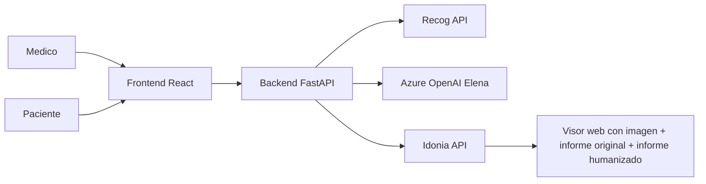

# 🎯 MediLink + Elena
### _Interoperabilidad clínica en tiempo real + explicación humana para pacientes_


> **Proyecto del hackatón orientado a “cerrar barreras” entre profesionales sanitarios y pacientes:**
> estructuración clínica, humanización de lenguaje y acceso seguro a imagen médica en un único visor.

---

## 💡 El Problema y Nuestra Solución

### Problema real en entorno clínico
- El profesional dedica demasiado tiempo a tareas administrativas y normalización de información clínica.
- El paciente recibe informes técnicamente correctos pero difíciles de entender.
- La evidencia diagnóstica (imagen + informe original + explicación humanizada) suele quedar fragmentada.

### Nuestra solución
**MediLink + Elena** conecta tres capas en un solo flujo:
1. **Recog** para captura/estructuración clínica.
2. **Azure OpenAI (Elena)** para traducción clínica a lenguaje humano, empático y multilingüe.
3. **Idonia** para entrega segura mediante Magic Link del visor con los artefactos clave.

### Valor de negocio y clínico
- Reducción de fricción operativa para el médico.
- Mejor comprensión y adherencia del paciente.
- Trazabilidad clínica y comunicación intercentro más eficaz.

---

## 🛠️ Arquitectura del Sistema y Stack Tecnológico

| Capa | Tecnología | Rol en la solución | Por qué esta elección |
|---|---|---|---|
| Backend API | FastAPI + Uvicorn (Python) | Orquestación de casos clínicos, seguridad, contratos API | Alto rendimiento, tipado robusto y rapidez de iteración |
| IA clínica | Azure OpenAI | Humanización de informe y asistente Elena | Calidad de respuesta y control de despliegue empresarial |
| Captura clínica | Recog API | Procesado de dictado e informe estructurado | Integración especializada para voz clínica |
| Imagen médica | Idonia API | Magic Link y visor médico/paciente | Encaje directo con el reto del hackatón |
| Frontend | React + TypeScript + Vite | UX para médico y paciente con flujos diferenciados | Productividad, tipado estricto y build rápido |

### Diagrama de alto nivel



---

## 🔄 Flujos Principales de la Aplicación

### 1) Captura y estructuración (Recog)
1. El médico inicia flujo clínico desde el panel.
2. Backend envía el contenido a Recog.
3. Se recupera salida estructurada y normalizada para continuidad asistencial.

### 2) Humanización y Avatar Elena (Azure OpenAI)
1. El backend construye prompt determinista con contexto clínico controlado.
2. Elena transforma lenguaje técnico en explicación clara para paciente.
3. Guardrails backend fuerzan una cláusula de descargo médico y formato seguro.

### 3) Entrega segura de imagen e informes (Idonia)
1. Se genera Magic Link del caso clínico.
2. En el visor se centralizan:
   - prueba de imagen,
   - informe médico original,
   - informe humanizado.

### Matriz de acceso por rol (Fase III)

| Rol | Acceso al visor Idonia | PIN en interfaz |
|---|---|---|
| Paciente | Magic Link seguro | ✅ Visible (QR+PIN) |
| Médico | Magic Link de seguimiento profesional | ✅ Visible (QR+PIN) |

---

## 🔐 Higiene de Seguridad y Calidad del Código

- ✅ **Auditoría forense interna de código** ejecutada para detectar residuos y configuraciones de riesgo.
- ✅ **Cero credenciales hardcodeadas** en el código publicado; configuración mediante variables de entorno.
- ✅ **Disciplina `.env`**: secretos fuera de repositorio y plantillas de configuración en `.env.example`.
- ✅ **`gitignore` defensivo** para evitar fugas (entornos, credenciales, artefactos sensibles).
- ✅ **Guardrails de prompts en backend** para reducir inyección de prompt, desvíos fuera de contexto y salida no conforme.

### Principios de seguridad aplicados
- Menor privilegio por rol.
- Contratos tipados para respuesta y errores.
- Fallbacks controlados con trazabilidad (`trace_id`).

---

## 🚀 Guía de Despliegue Rápido (Local Quickstart)

### Requisitos
- Python 3.12+
- Node.js 18+
- npm 9+

### 1) Backend

```bash
cd backend
python -m venv .venv
source .venv/bin/activate   # Windows: .venv\Scripts\activate
pip install -r requirements.txt
cp .env.example .env
uvicorn main:app --reload --port 8000
```

Backend disponible en:
- API: `http://localhost:8000`
- Swagger: `http://localhost:8000/docs`

### 2) Frontend

```bash
cd frontend
npm install
npm run dev
```

Frontend disponible en:
- App: `http://localhost:5173`

### 3) Estructura recomendada de `.env.example`

```env
# Idonia
IDONIA_PUBLIC_ID=
IDONIA_API_SECRET=
IDONIA_API_KEY=
IDONIA_MAGIC_LINK_REFERENCE_MODE=route_folder
IDONIA_MAGIC_LINK_PIN=
IDONIA_PATIENT_PASSWORD=

# Recog
RECOG_API_URL=https://api.recog.es/relisten/dictation/process/report-results
RECOG_AUTH_MODE=auto
RECOG_AUTH_BASE_URL=https://api.recog.es/auth
RECOG_CLIENT_ID=
RECOG_CLIENT_SECRET=
RECOG_API_KEY=
RECOG_STRICT_MODE=false

# Azure OpenAI
AZURE_OPENAI_ENDPOINT=
AZURE_OPENAI_API_KEY=
AZURE_OPENAI_DEPLOYMENT=Phi-3.5-mini-instruct
AZURE_OPENAI_API_VERSION=2024-02-01

# App
INTEGRATION_TIMEOUT_SECONDS=60
JWT_SECRET=change-this-secret-in-production
APP_ENV=development
```

---

## 🧪 Cuentas demo

| Usuario | Password | Rol |


## � Despliegue en Azure

### Prerrequisitos
- Azure CLI instalado y autenticado (`az login`)
- Azure App Services configurados (backend + frontend)
- App Settings configurados en Azure Portal con todas las variables de entorno

### Configuración de Deployment

1. **Copiar template de configuración:**
   ```bash
   cp .env.deployment.example .env.deployment
   ```

2. **Editar `.env.deployment` con tus recursos Azure:**
   ```bash
   # Azure Resource Group
   export RESOURCE_GROUP=tu-resource-group
   
   # Backend Web App
   export WEBAPP_NAME=tu-backend-webapp
   export BACKEND_WEBAPP_NAME=tu-backend-webapp
   
   # Backend URL (para build de frontend)
   export BACKEND_API_URL=https://tu-backend.azurewebsites.net
   ```

3. **Cargar variables de entorno:**
   ```bash
   source .env.deployment
   ```

### Despliegue Backend

```bash
# Cargar configuración
source .env.deployment

# Desplegar backend a Azure
bash scripts/deploy_backend_one_shot.sh
```

### Despliegue Frontend

```bash
# Cargar configuración (si no está cargada)
source .env.deployment

# Actualizar WEBAPP_NAME para frontend
export WEBAPP_NAME=tu-frontend-webapp

# Desplegar frontend a Azure
bash scripts/deploy_frontend_one_shot.sh
```

### Despliegue Full-Stack (ambos)

```bash
# Cargar configuración
source .env.deployment

# Desplegar backend + frontend automáticamente
bash scripts/deploy_azure_one_shot.sh
```

### Notas de Seguridad

- ⚠️ **NUNCA** commitear `.env.deployment` (está en `.gitignore`)
- ✅ Usar `.env.deployment.example` como plantilla
- ✅ Los scripts validan que todas las variables requeridas estén configuradas
- ✅ Secretos (API keys, tokens) se configuran en Azure App Settings, NO en código

Para más detalles de seguridad, ver [SECURITY.md](SECURITY.md).

---

## �📌 Estado del proyecto

MediLink + Elena está diseñado para demostrar **viabilidad técnica inmediata** en entorno de hackatón y **escalabilidad a producto real** con foco en interoperabilidad, seguridad y experiencia humana del paciente.
